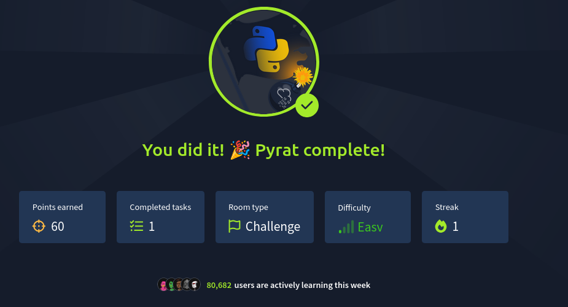

**Project:** Pyrat — a Python-based penetration-testing toolkit for network reconnaissance and exploit automation.  
**Repo:** 0x-lian/Pyrat

Pyrat is a minimalist, modular toolkit intended for learning and authorized pentesting. This document covers installation, quick usage, an example module walkthrough, and where to place screenshots.

---


```bash
# optional: create venv
python3 -m venv venv
source venv/bin/activate

# install deps
pip install -r requirements.txt


---

## Completion Screenshot

Congratulations! 🎉 Pyrat has been successfully run.


*Figure — Confirmation screenshot showing "You did it — Pyrat complete".*

